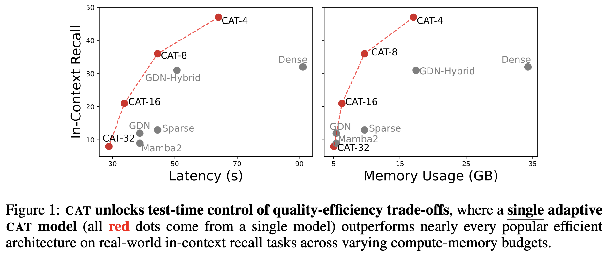
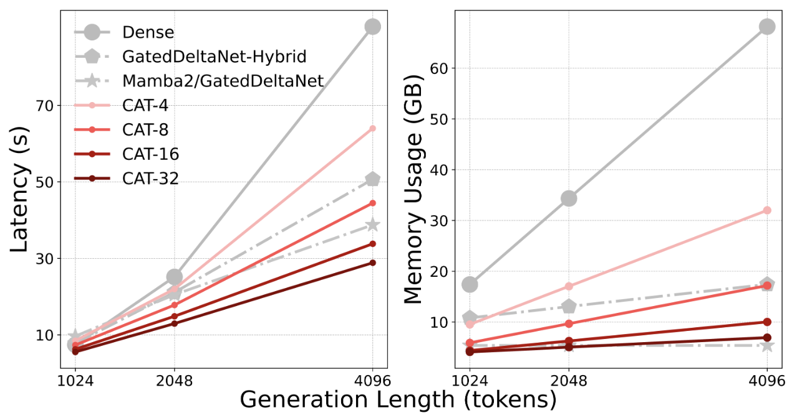

# Compress And Attend Transformers (CATs)

> [**Attention and Compression is all you need for Controllably Efficient Language Models**](https://arxiv.org/abs)<br>
> [Jatin Prakash](https://bicycleman15.github.io), [Aahlad Puli](https://aahladmanas.github.io), [Rajesh Ranganath](https://rajesh-lab.github.io)
> <br>New York University<br>

This repository provides hackable, scalable and efficient pure PyTorch implementation for CATs.

<p align="center">
  
</p>

## Overview
- CATs model _chunks of tokens_ given compressed representations of past chunks in the sequence 😸.
<!--  -->
<p align="center">
  
</p>

- CATs demonstrate one needs **only two simple ingredients** (dense attention and compression) to design a **simple**, **efficient** and importantly, an **adaptive** architecture. No need to heuristically define sparse attention masks; no need for handcrafted and complex recurrent state update rules; no need to carefully compose with attention at specific layers to have a capable architecture 💆‍♀️😌. (The troubled cat 😿 below describes the overwhelming feeling of designing an efficient architecture)
<p align="center">
  
</p>

- Due to **_compression_** resulting in a reduced sequence length, compute FLOPs & KV-cache memory diminish by a factor of chunk size (upto **3x faster** and **9x memory efficient** 🚀)
<p align="center">
  
</p>

- Choosing chunk size (i.e. how much to compress?) allows CATs to **interpolate** between compressed (fast) and dense (slow) transformer directly at **test-time** ⏰, trading off quality for efficiency.

- We take the core concepts and instantiate CAT as a layer which can be swapped in any sequence model as a **drop-in replacement**, replacing dense attention. This can unlock lots of interesting possibilities starting with creating hybrid as well as adaptive architectures that mixes CAT layers alongside dense attention, or perhaps even linear attention.

## Usage

> ⚠️ Right now, the implementation only supports training fixed chunk size CATs. We will release the adaptive version soon!

Here are some things to keep in mind:
- `transformer.py` contains a fast implementation for transformer++. Highly inspired from the Lightning-AI/litgpt repo. To make this implementation efficient, it uses triton kernels from linkedin/Liger-Kernel. CAT's implementation directly imports components from here since it builds on vanilla transformer abstractions.
- `cat_transformer.py` contains a scalable implementation for CATs. We provide a simple usage that can be directly used in most training scripts.

> Note that according to the paper, the decoder in CAT should be made more expressive (contain more parameters) in order to accurately decode from the compressed chunk representations (refer to below usage to correctly instantiate a CAT)

```python
device = "cuda" if torch.cuda.is_available() else "cpu"

# below assumes that one wishes to instantiate a CAT that matches
# a vanilla transformer containing 12 layers, and hidden size of 768
dim = 768
n_head = 12
num_layers = 12

# this is the hidden size of decoder, which is recommended to be 2*dim
# however, it can be 1.5*dim, or 1.25*dim depending on the task
# dim_fx means the size of the compressed chunk representations (f(c)'s), which
# is same as hidden size of the decoder
decoder_dim = 2 * dim # hidden size of the decoder
dim_fx = decoder_dim # size of compressed chunk representations
n_head_decoder = 2 * n_head # increase heads too proportionally

block_size = 2048 # context length
chunk_size = 8 # chunk size

# instantiate the model
compressor_config = CAT_Config(dim=dim, n_head=n_head, dim_fx=dim_fx, block_size=block_size, chunk_size=chunk_size, n_layer=(num_layers // 4)) # layers are defined according to the paper, but one may use lower number of layers in the compressor
decoder_config = CAT_Config(dim=decoder_dim, n_head=n_head_decoder, block_size=block_size, chunk_size=chunk_size, n_layer=num_layers)
model = CAT_Transformer(decoder_config, compressor_config)
model = model.to(device=device)
model.setup_cache(device=device)

# do forward pass
input_ids = torch.randint(0, decoder_config.vocab_size, (4, block_size), device=device)
logits = model(input_ids)
# do stuff with logits ...
```

### Benchmark CATs
Refer to `benchmark.py` to measure generation throughput and memory usage of CATs.

### Usage for CAT as a drop-in layer

Refer to `cat_layer.py`

```python
device = "cuda" if torch.cuda.is_available() else "cpu"

# simple test
batch_size = 4
seq_len = 2048
chunk_size = 8

config = CAT_Config(
    dim=768,
    n_head=16,
    chunk_size=chunk_size,

    # again, needs 2*dim for accurate decoding from compressed chunk representations
    dim_fx=2 * 768, 

    block_size=seq_len,

    # right now, every layer is a CAT layer
    # but the implementation can be easily modified to create hybrid architectures :)
    n_layer=12,
)

model = CAT_Layer_Transformer(config)
model.setup_cache(device=device)
model.to(device)

x = torch.randint(0, config.padded_vocab_size, (batch_size, seq_len), device=device)

logits = model(x)

# do stuff with logits ...
```

## Acknowledgements
This implementation borrows heavily from the following repositories:

- [Lightning-AI/litgpt](https://github.com/Lightning-AI/litgpt)
- [linkedin/Liger-Kernel](https://github.com/linkedin/Liger-Kernel)
- [meta-pytorch/gpt-fast](https://github.com/meta-pytorch/gpt-fast)