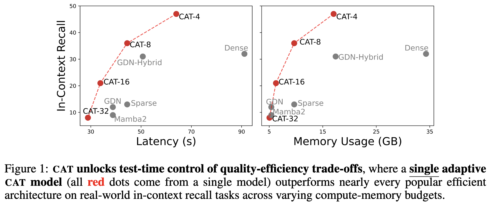
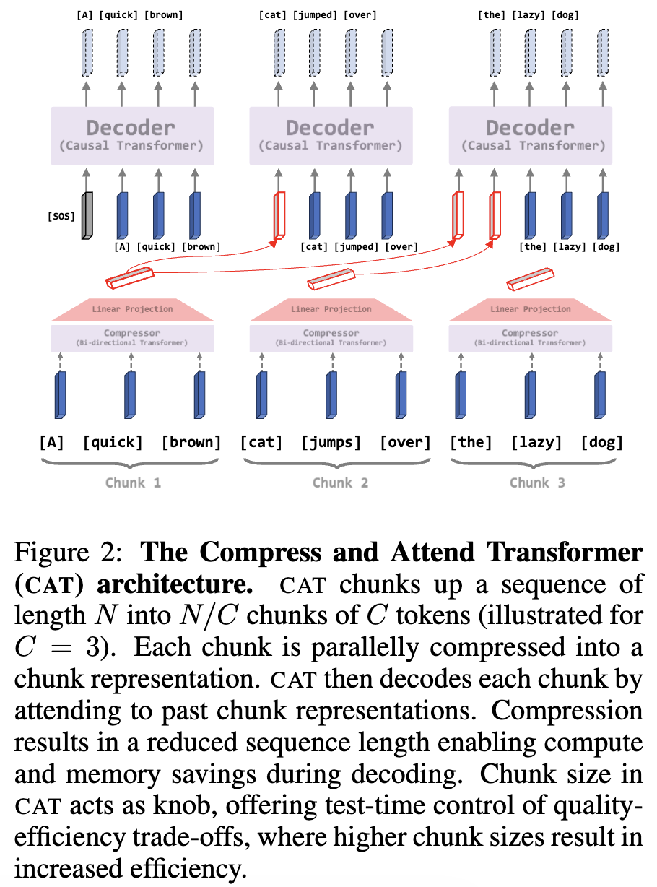
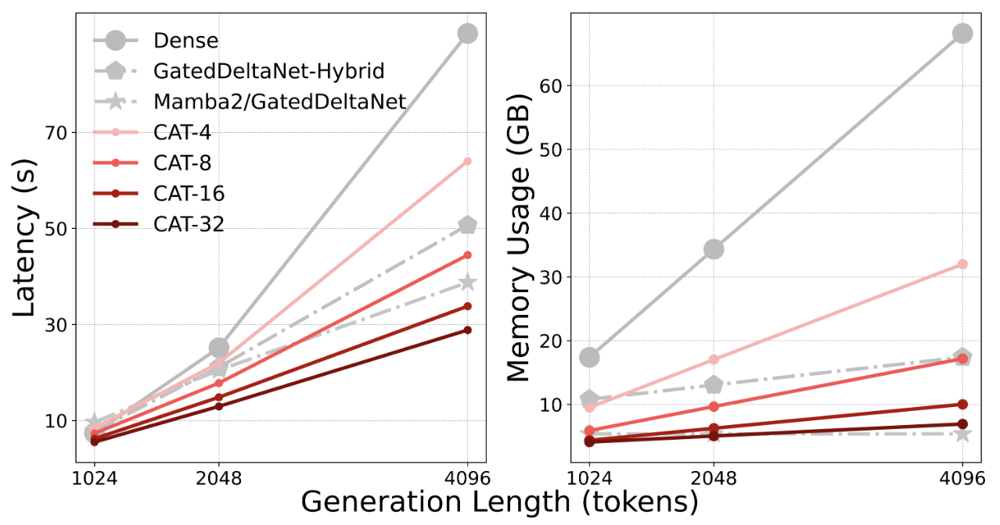

<p align="center" width="100%">

</p>

<div align="center">

# Compress And Attend Transformers (CATs)

This repository provides single-file hackable, scalable and efficient 🚀 _pure_ PyTorch implementation for CATs.
</div>

> [**Controllably Efficient Language Models**](https://arxiv.org/abs/2511.05313)<br>
> [Jatin Prakash](https://bicycleman15.github.io), [Aahlad Puli](https://aahladmanas.github.io), [Rajesh Ranganath](https://rajesh-lab.github.io)
> <br>New York University<br>

<div align="center">

[](https://arxiv.org/abs/2511.05313)
[](https://x.com/bicycleman15/status/1987895472409673972)
[](https://huggingface.co/collections/bicycleman15/cat-transformer)


</div>

# News

- [2026-03] 🤗 Pre-trained checkpoints for vanilla and CAT transformer are released on HF, along with training infra code.

- [2025-11] 📄 Paper and Code for CAT is out!


# Overview


- simple architecture that employs two simple well-known ingredients: dense attention and compression.
- provides a _controllable knob_ at **test-time** to trade-off quality for efficiency, **interpolating between dense transformer and efficient alternatives**, all without any retraining.
- can be used as a drop-in replacement for dense/linear attention layers in any architecture to create _controllably_ 🕹️ efficient architectures.

<p align="center">
  
</p>

<!-- <p align="center">
  
</p> -->

## Summary
- CATs model _chunks of tokens_ given compressed representations of past chunks in the sequence 😸.

- No need to heuristically define attention masks; no need for handcrafted and complex recurrent state update rules; no need to carefully compose with attention at specific layers to have a capable architecture 💆‍♀️😌. 

>The troubled cat 😿 below describes the overwhelming feeling of designing an efficient architecture
<p align="center">
  
</p>

- Due to **_compression_** resulting in a reduced sequence length, compute FLOPs & KV-cache memory diminish by a factor of chunk size (upto **3x faster** and **9x memory efficient** 🚀)
<p align="center">
  
</p>

- Choosing chunk size (i.e. how much to compress?) allows CATs to **interpolate** between compressed (fast) and dense (slow) transformer directly at **test-time** ⏰, trading off quality for efficiency.

- We take the core concepts and instantiate CAT as a layer which can be swapped in any sequence model as a **drop-in replacement**, replacing dense attention. This can unlock lots of interesting possibilities starting with creating hybrid as well as adaptive architectures that mixes CAT layers alongside dense attention, or perhaps even linear attention.

## Usage

> 💁‍♂️ We have released model checkpoints at [HuggingFace](https://huggingface.co/collections/bicycleman15/cat-transformer). Please refer to the `generate.py` for starter code. Note that these released models are not the same models in the paper. The released models were re-trained on same number of tokens using the code released in this repo using a slightly different config (namely having QK-norm). Nevertheless, they have the same trend and have similar numbers as observed in the paper. 

Here are some things to keep in mind:
- `transformer.py` contains a fast implementation for transformer++. Highly inspired from the `Lightning-AI/litgpt` repo. To make this implementation efficient, it uses triton kernels from `linkedin/Liger-Kernel` repo. CAT's implementation directly imports components from here since it builds on vanilla transformer abstractions.
- `cat_transformer.py` contains a scalable implementation for CATs. We provide a simple usage that can be directly used in most training scripts. This supports fixed chunk sizes only.
- `cat_transformer_adaptive.py` contains an implementation for adaptive CATs that can work with multiple chunk sizes, thereby unlocking controllable efficiency.
- `cat_layer.py` contains an implementation of CAT as a **drop-in transformer layer** (`CAT_Transformer_Block`). Instead of a separate compressor/decoder architecture, each layer internally compresses chunks, performs block-diagonal CAT attention in an expanded hidden dimension (`dim_fx`), rearranges the output back to the original sequence layout, and projects back down to `dim`. This makes it easy to build hybrid architectures where only some layers use CAT-style attention while others use standard attention.

Please refer to usages below for more details.

> ⚠️ Note that according to the paper, the decoder in CAT should be made more expressive (contain more parameters) in order to accurately decode from the compressed chunk representations (refer to below usage to correctly instantiate a CAT). This does not mean CATs are inefficient -- in fact, due to compression, CATs are much more efficient than vanilla transformers (of smaller sizes) in terms of throughput and total memory usage.

<details>
  <summary> <b>⚠️ Important: RoPE encodings in CAT </b> </summary>

**RoPE encodings:** CAT uses a slightly different RoPE positional encoding -- specifically, positions reset at every chunk boundary. A standard transformer with `block_size = 2048` would assign RoPE positions `[0, 1, 2, ..., 2047]` across the full sequence. CAT instead builds a RoPE cache of length `1 + chunk_size` (to account for the prepended position token in the compressor) and then **repeats** it for each chunk. Concretely, if `chunk_size = 16` and `num_chunks = 128`, each chunk's tokens receive local positions `[0, 1, ..., 16]` rather than globally increasing ones. After repeating and flattening, the cache is trimmed to length `block_size + num_chunks + 1` so it covers the full interleaved sequence of compressed chunk representations (f(c)'s) and raw tokens. This "resetting" RoPE scheme means attention within a chunk uses local relative positions, which aligns with CAT's block-diagonal attention mask -- tokens only attend within their own chunk (plus the chunk's compressed representation), so global positions would be meaningless. A separate, standard (non-resetting) RoPE cache (`cos_gen` / `sin_gen`) of length `block_size` is also built for autoregressive generation, where tokens are decoded one at a time with globally increasing positions. Please refer to `setup_cache` in `cat_transformer.py` for the corresponding code.

**RoPE encodings in the adaptive variant (`cat_transformer_adaptive.py`):** The adaptive CAT supports variable chunk sizes (powers of two up to `chunk_size`), so it cannot use a single pre-built RoPE cache. Instead, `setup_cache` iterates over every valid chunk-size exponent `c` in `range(1 + log2(chunk_size))` and builds a **separate** resetting RoPE cache for each. For a given exponent `c`, the current chunk size is `2^c` and the number of chunks is `block_size / 2^c`. The per-chunk cache length is `2 + 2^c` (rather than `1 + chunk_size` in the fixed variant) because the adaptive compressor prepends **two** special tokens -- a position token *and* an adaptive token that signals which chunk size is in use. Each per-chunk cache is repeated `num_chunks + 1` times, flattened, and trimmed to `block_size + 2*num_chunks + 2`. The resulting caches are stored in dictionaries (`self.cos[c]`, `self.sin[c]`) keyed by the chunk-size exponent, and the appropriate one is selected at runtime based on the `chunk_size_power` argument passed to `forward`. The generation cache (`cos_gen` / `sin_gen`) is set only once, from the **largest** chunk size (i.e. when `c == log2(chunk_size)`). Please refer to `setup_cache` in `cat_transformer_adaptive.py` for the corresponding code.

> ⚠️ We find above defined RoPE encoding gives the best performance  in CAT.

</details>

<details>
  <summary> <b>Usage for CATs with fixed chunk size </b> </summary>

Refer to `cat_transformer.py`

```python
device = "cuda" if torch.cuda.is_available() else "cpu"

# below assumes that one wishes to instantiate a CAT that matches
# a vanilla transformer containing 12 layers, and hidden size of 768
dim = 768
n_head = 12
num_layers = 12

# this is the hidden size of decoder, which is recommended to be 2*dim
# however, it can be 1.5*dim, or 1.25*dim depending on the task
# dim_fx means the size of the compressed chunk representations (f(c)'s), which
# is same as hidden size of the decoder
decoder_dim = 2 * dim # hidden size of the decoder
dim_fx = decoder_dim # size of compressed chunk representations
n_head_decoder = 2 * n_head # increase heads too proportionally

block_size = 2048 # context length
chunk_size = 8 # chunk size

# instantiate the model
compressor_config = CAT_Config(dim=dim, n_head=n_head, dim_fx=dim_fx, block_size=block_size, chunk_size=chunk_size, n_layer=(num_layers // 4)) # layers are defined according to the paper, but one may use lower number of layers in the compressor
decoder_config = CAT_Config(dim=decoder_dim, n_head=n_head_decoder, block_size=block_size, chunk_size=chunk_size, n_layer=num_layers)
model = CAT_Transformer(decoder_config, compressor_config)
model = model.to(device=device)
model.setup_cache(device=device)

# do forward pass
input_ids = torch.randint(0, decoder_config.vocab_size, (4, block_size), device=device)
logits = model(input_ids)
# do stuff with logits ...
```

</details>

<details>
  <summary> <b>Benchmark CATs </b> </summary>

Refer to `benchmark.py` to measure generation throughput and memory usage of CATs.

</details>

<details>
  <summary> <b>Usage for adaptive CATs </b> </summary>

Refer to `cat_transformer_adaptive.py`

```python
device = "cuda" if torch.cuda.is_available() else "cpu"

# below assumes that one wishes to instantiate a CAT that matches
# a vanilla transformer containing 12 layers, and hidden size of 768
dim = 768
num_layers = 4
n_head = 12

# this is the hidden size of decoder, which is recommended to be 2*dim
# however, it can be 1.5*dim, or 1.25*dim depending on the task
# dim_fx means the size of the compressed chunk representations (f(c)'s), which
# is same as hidden size of the decoder
decoder_dim = 2 * dim # hidden size of the decoder
dim_fx = decoder_dim # size of compressed chunk representations
n_head_decoder = 2 * n_head # increase heads too proportionally

block_size = 2048 # context length
chunk_size = 32 # chunk size

# instantiate the model
compressor_config = CAT_Config(dim=dim, n_head=n_head, dim_fx=dim_fx, block_size=block_size, chunk_size=chunk_size, n_layer=(num_layers // 4)) # layers are defined according to the paper, but one may use lower number of layers in the compressor
decoder_config = CAT_Config(dim=decoder_dim, n_head=n_head_decoder, block_size=block_size, chunk_size=chunk_size, n_layer=num_layers)
model = CAT_Transformer(decoder_config, compressor_config)
model = model.to(device=device)
model.setup_cache(device=device)

# do forward pass
input_ids = torch.randint(0, decoder_config.vocab_size, (4, block_size), device=device)
print("input_ids shape:", input_ids.shape)

# choose which chunk size to use for this forward pass
# must be power of 2, and and less than or equal to chunk_size
# only powers of two supported for now
cur_chunk_size_power = 4 # corresponds to chunk size of 16 (2^4)

logits = model(input_ids, chunk_size_power=cur_chunk_size_power)

print("logits shape:", logits.shape)
# do stuff with logits ...
```
</details>

<details>
  <summary> <b>Usage for CAT as a drop-in replacement layer</b> </summary>

Refer to `cat_layer.py`

```python
device = "cuda" if torch.cuda.is_available() else "cpu"

# simple test
batch_size = 4
seq_len = 2048
chunk_size = 8

config = CAT_Config(
    dim=768,
    n_head=16,
    chunk_size=chunk_size,

    # again, needs 2*dim for accurate decoding from compressed chunk representations
    dim_fx=2 * 768, 

    block_size=seq_len,

    # right now, every layer is a CAT layer
    # but the implementation can be easily modified to create hybrid and adaptive architectures :)
    n_layer=12,
)

model = CAT_Layer_Transformer(config)
model.setup_cache(device=device)
model.to(device)

x = torch.randint(0, config.padded_vocab_size, (batch_size, seq_len), device=device)

logits = model(x)

# do stuff with logits ...
```
</details>

## Installation
Here are the packages that we used to run our code:

```bash
torch==2.5.1+cu121
liger-kernel
```

## Training

Tokenize the dataset first using `prepare_sharded_data.py` (feel free to change it).

Then refer to `run.sh` for some sample commands to run training.

Finally, once the model is trained, please refer to `eval/harness.py` to perform evaluations.

Refer to `sample_run.sh` to look at the training command. Feel free to modify it.

# Acknowledgements
This implementation borrows heavily from the following repositories:

- [Lightning-AI/litgpt](https://github.com/Lightning-AI/litgpt)
- [linkedin/Liger-Kernel](https://github.com/linkedin/Liger-Kernel)
- [meta-pytorch/gpt-fast](https://github.com/meta-pytorch/gpt-fast)

# Support
Feel free to open issues for any questions or clarifications regarding the code or paper. Thanksss!

Consider giving this repo a ⭐ if you found it useful 😊
